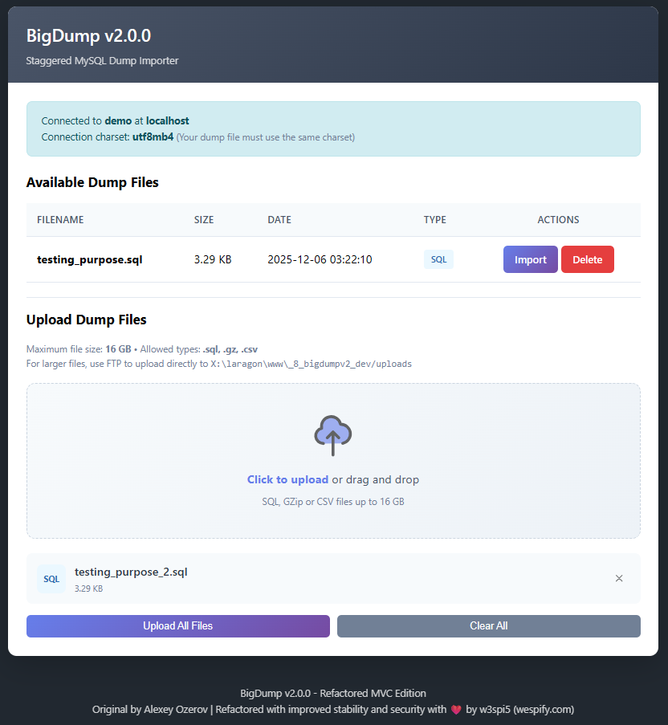

# BigDump 2.4 - Staggered MySQL Dump Importer

[](https://php.net/)
[](LICENSE)

<p align="center">
  
</p>

BigDump is a PHP tool for importing large MySQL dumps on web servers with strict execution time limits. This version 2.4 is a complete refactoring using object-oriented MVC architecture.

## Features

- **Staggered Import**: Imports dumps in sessions to bypass timeout limits
- **Multi-format Support**: `.sql`, `.gz` (gzip), and `.csv` files
- **AJAX Mode**: Import without page refresh (recommended)
- **Modern Interface**: Responsive and intuitive design
- **Enhanced Security**: Protection against path traversal, XSS, and other vulnerabilities
- **Error Handling**: Clear and detailed error messages
- **UTF-8 Support**: Proper handling of multi-byte characters and BOM

## Requirements

- PHP 8.1 or higher
- MySQLi extension
- MySQL/MariaDB server
- Write permissions on the `uploads/` directory

## Installation

1. **Download** the project to your web server:
   ```bash
   git clone https://github.com/w3spi5/bigdump.git
   # or download and extract the archive
   ```

2. **Configure** the database:
   ```bash
   cp config/config.example.php config/config.php
   ```
   Then edit `config/config.php` with your database credentials:
   ```php
   return [
       'db_server' => 'localhost',
       'db_name' => 'your_database',
       'db_username' => 'your_username',
       'db_password' => 'your_password',
       'db_connection_charset' => 'utf8mb4',
   ];
   ```

3. **Set permissions**:
   ```bash
   chmod 755 uploads/
   ```

4. **Access** BigDump via your browser:
   ```
   http://your-site.com/bigdump/public/index.php
   ```

## Project Structure

```
bigdump/
├── config/
│   ├── config.example.php  # Configuration template
│   └── config.php          # User configuration (create from example)
├── public/
│   └── index.php           # Entry point
├── src/
│   ├── Config/
│   │   └── Config.php      # Configuration manager
│   ├── Controllers/
│   │   └── BigDumpController.php
│   ├── Core/
│   │   ├── Application.php # Main application
│   │   ├── Request.php     # HTTP request wrapper
│   │   ├── Response.php    # HTTP response wrapper
│   │   ├── Router.php      # Router
│   │   └── View.php        # Template engine
│   ├── Models/
│   │   ├── Database.php    # MySQL connection
│   │   ├── FileHandler.php # File management
│   │   ├── ImportSession.php # Session state
│   │   └── SqlParser.php   # SQL parser
│   ├── Services/
│   │   ├── AjaxService.php # AJAX responses
│   │   └── ImportService.php # Import service
│   └── Views/
│       ├── error.php       # Error page
│       ├── home.php        # Home page
│       ├── import.php      # Import page
│       └── layout.php      # Main template
├── uploads/                # Dump files directory
├── LICENSE
└── README.md
```

## Advanced Configuration

### Import Options

```php
return [
    // Lines per session (reduce if timeout occurs)
    'linespersession' => 3000,

    // Delay between sessions (ms) to reduce server load
    'delaypersession' => 0,

    // AJAX mode (recommended)
    'ajax' => true,

    // Test mode (parse without executing)
    'test_mode' => false,
];
```

### CSV Configuration

```php
return [
    'csv_insert_table' => 'my_table',
    'csv_preempty_table' => false,
    'csv_delimiter' => ',',
    'csv_enclosure' => '"',
];
```

### Pre-queries

```php
return [
    'pre_queries' => [
        'SET foreign_key_checks = 0',
        'SET unique_checks = 0',
    ],
];
```

## Bug Fixes Compared to Original

1. **Excessive Sanitization**: Valid UTF-8 characters are now preserved
2. **Quote Handling**: Correct detection of `\\'` (escaped backslash)
3. **Gzip Files**: Fixed seek handling
4. **Path Traversal**: Protection against `../` attacks
5. **XSS**: Systematic escaping of HTML output
6. **Race Conditions**: Atomic upload handling
7. **Memory**: Configurable limit per query
8. **BOM**: UTF-8, UTF-16, and UTF-32 support
9. **DELIMITER**: Detection only outside strings
10. **CSV**: Correct parsing of fields with internal delimiters

## Security

- **NEVER** leave BigDump and your dump files on a production server after use
- Dump files may contain sensitive data
- The `uploads/` directory is protected by `.htaccess`
- Delete the application as soon as the import is complete

## License

[MIT](LICENSE)

## Credits

- **Original**: Alexey Ozerov (http://www.ozerov.de/bigdump)
- **MVC Refactoring**: Version 2.4 with object-oriented architecture by [w3spi5](https://github.com/w3spi5)
